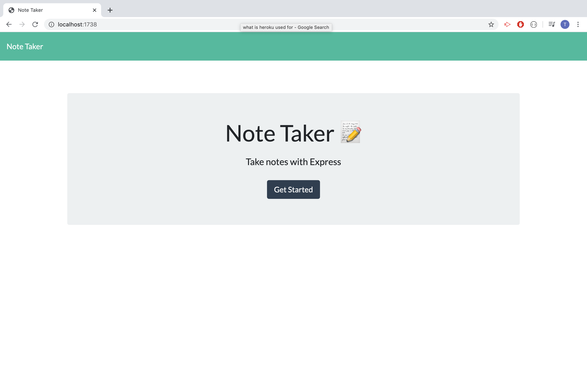
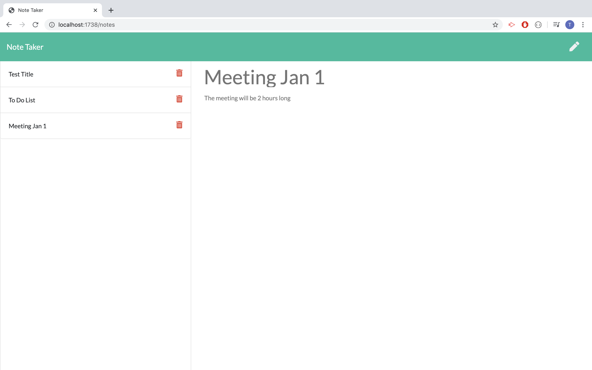

# Note Taker

# Summary
    - This a note taker running through localhost. All the notes will be save and pull from json file. 

# Techonologoies Used
    - NPM: to install all the requirement to run the app.
    - Git: to commit and push.
    - Node.js: to run the script.
    - Path: to navigate files.
    - Heroku: to deploy, manage, and scale modern app. The path to getting the app to market.
    - Database.json: to store all the database.

# Site Picture and PDF



# Code Snippet
```js
class Notes {
    constructor() {
        this.id = 0;
    }
    read() {
        return readFileAsyn("db/db.json", "utf8");

    }
    write(note) {
        return writeFileAsync("db/db.json", JSON.stringify(note))
    }
    getNotes() {
        console.log("get notes")
        return this.read().then(notes => {
            // console.log(notes)
            let notesArray;
            try {
                notesArray = [].concat(JSON.parse(notes));
            }
            catch (err) {
                notesArray = [];
            }
            return notesArray;
        })

    }
```
These codes used to read, get the notes inside the database.json and write the new notes into the database.json

# Author Links
[LinkedIn](www.linkedin.com/in/tu-tai-le-2a9646139)
[GitHub](https://github.com/TaiLe96/note-taker)